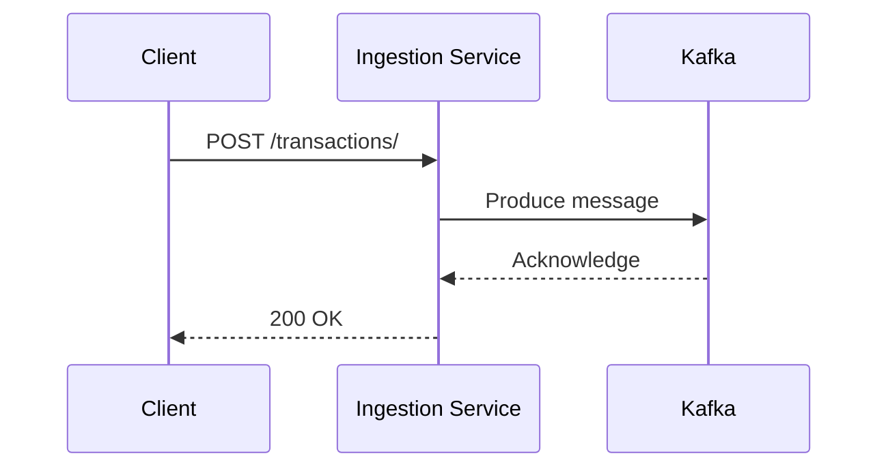

# Ingestion Service

This project contains a transaction ingestion service that receives transaction data, validates it, and pushes it to a Kafka topic for downstream processing. The service is implemented in both Python and TypeScript, and can be deployed to Kubernetes using Helm.

## Transaction Flow

The following diagram illustrates the flow of a transaction from a client to the ingestion service and into Kafka:



## Getting Started

This section provides instructions on how to work with the Python implementation of the ingestion service (`ingestion-service-py`). For instructions on the TypeScript implementation, see the `ingestion-service-ts/README.md` file.

### Prerequisites

*   Python 3.9+
*   Docker
*   kubectl
*   Helm

### Local Development

**Note:** The service requires a running Kafka instance. For local development, you can use the provided Docker Compose file to start Kafka: `make -C deploy install-kafka`

1.  **Install dependencies:**

    ```bash
    pip install -r ingestion-service-py/requirements.txt
    ```

2.  **Run the service:**

    The service will be available at `http://localhost:8000`.

    ```bash
    export KAFKA_HOST=localhost
    export KAFKA_PORT=9092
    uvicorn ingestion-service-py.main:app --host 0.0.0.0 --port 8000
    ```

3.  **Run tests:**

    ```bash
    python -m pytest ingestion-service-py/test_main.py
    ```

### Building and Pushing the Container Image

1.  **Login to your container registry (e.g., quay.io):**

    ```bash
    docker login quay.io
    ```

2.  **Build and push the image:**

    Replace `<your-username>` with your container registry username.

    ```bash
    cd ingestion-service-py
    docker build -t quay.io/<your-username>/ingestion-service-py:latest .
    docker push quay.io/<your-username>/ingestion-service-py:latest
    cd ..
    ```

### Deployment

The ingestion service and Kafka are deployed to Kubernetes using Helm.

1.  **Deploy Kafka:**

    This will deploy Kafka to your Kubernetes cluster in the `kafka` namespace.

    ```bash
    make -C deploy install-kafka
    ```

2.  **Update the `values.yaml` file:**

    Before deploying the ingestion service, you need to update the `image.repository` value in `deploy/ingestion-service-py/helm/values.yaml` to point to your container registry.

3.  **Deploy the `ingestion-service-py`:**

    ```bash
    make -C deploy install-ingestion-py
    ```

### Testing with cURL

1.  **Port-forward the service:**

    ```bash
    kubectl port-forward svc/ingestion-py 8080:80
    ```

2.  **Send a test transaction:**

    ```bash
    curl -X POST "http://localhost:8080/transactions/" \
    -H "Content-Type: application/json" \
    -d '{
        "user_id": 123,
        "card_id": 456,
        "amount": 78.90,
        "description": "Test transaction"
    }'
    ```
